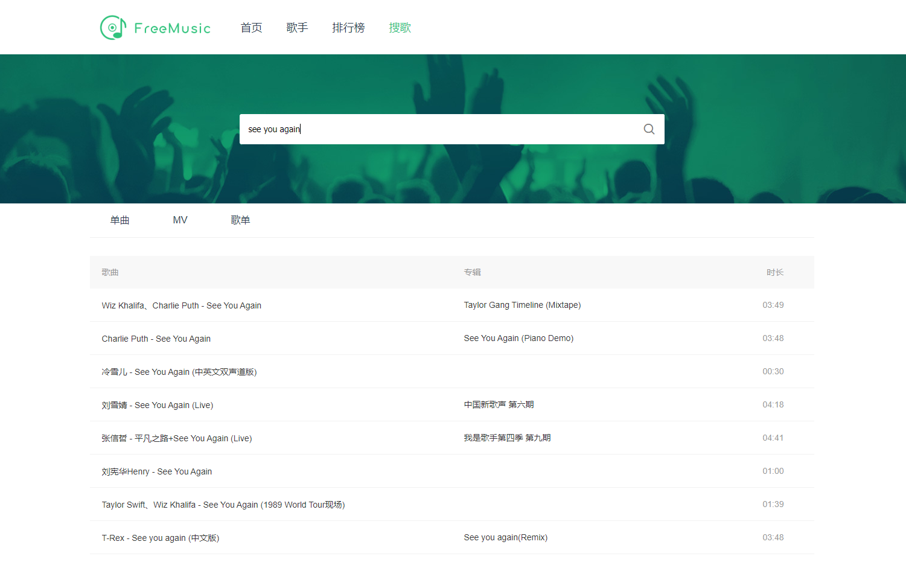
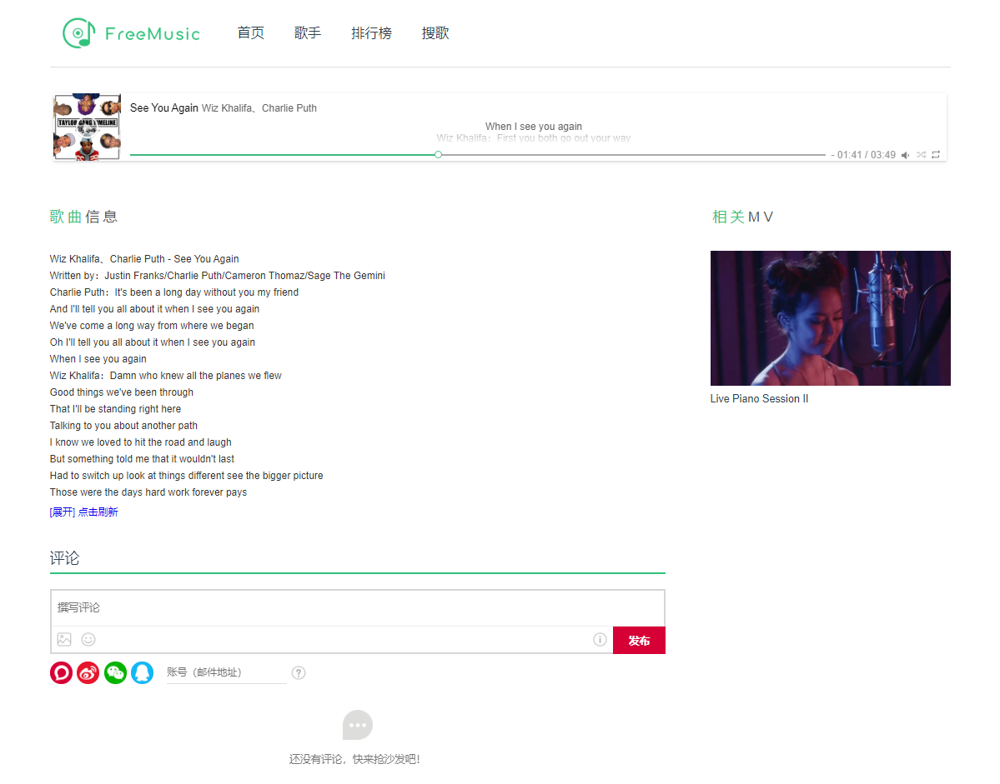

# FreeMusic

> A simple, beautiful music website

- [x] 歌曲、歌手、专辑、MV搜索
- [x] 歌曲播放 + 歌词
- [x] MV播放
- [X] 登录、注册
- [x] 评论
- [ ] 添加歌曲列表

## Partial Screenshot






## Build Setup

``` bash
# clone project
git clone git@github.com:Hrealm/freemusic.git

# enter project folder
cd freemusic

# install dependencies
npm install

# serve with hot reload at localhost:8080
npm run dev

# build for production with minification
npm run build

```

##  Start Local Server

```bash
# start node server at localhost:8899
node ./src/node/node.js
```

## 声明

本项目仅供学习与交流，不用于商业，数据均来源网络，如有侵权联系删除！

## License

[MIT](https://github.com/Hrealm/freemusic/blob/master/LICENSE)
